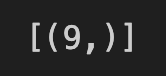

# sqlAlchemy-challenge

A SQLAlchemy project for analyzing weather data and using Flask to build a weather API.

## Table of Contents
#### Introduction
#### Requirements & Dependencies
#### Analysis and Results
#### Usage
#### Contributing
#### License
 

#### Introduction
This project uses SQLAlchemy and Flask to analyze Hawaii weather data and build an API. 

##### Features
- Precipitation Data: Access historical precipitation data from a specified date range.

- Station Information: Retrieve information about weather stations, including station names and locations.

- Temperature Observations: Get temperature observations for the most active weather station within a specific date range.
 

#### Requirements & Dependencies
You will need the following software to run the analysis and API scripts:
- Python 3.10
- Pandas
- NumPy
- Matplotlib
- Datetime
- SQLAlchemy
- Flask
 

#### Project Structure
- **Create Engine:** The project starts with using a Jupyter Notebook file to create an engine and reflect a SQLite database containing Hawaii weather data. 
 
 

---
- **Classes/Table Names:** The classes/table names in the database were fetched and displayed.
#### Output

 
 
 
 
 

---
- **Create table references and a session to run the weather analysis:** 
 
 

---
#### Analysis and Results
**1.** Find the most recent date in the data set.
#### Output

 
 
 
 
 

---
**2.** Retrieve the last 12 months of precipitation data, save the results as a Pandas DataFrame, and then preview the DataFrame's head and tail to double check the dates. 
#### Output
 

 
 
 
 
 

---
**3.** Plot the precipitation data with Matplotlib 'fivethirtyeight' style.
#### Output

 
 
 
 
 

---
**4.** Calculate the summary statistics for the precipitation data.
#### Output

 
 
 
 
 

---
**5.** Calculate the total number of stations in the dataset.
#### Output

 
 
 
 
 

---
**6.** Arrange the stations by activity, in descending order, to determine the most active station.
#### Output

 
 
 
 
 

---
**7.** State which station is the most active.
#### Output

 
 
 
 
 

---
**8.** Calculate the lowest, highest, and average temperature for the most active station.
#### Output

 
 
 
 
 

---
**9.** Get the last 12 months of temperature observation data for the most active station and plot the results as a histogram.
#### Output

 
 
 
 
 

---

#### Build and execute the Hawaii Weather API
**1.** Use a Pyhton script to build the Hawaii weather database: Create an engine, reflect and reference the classes/tables.
 

---
**2.** Set up Flask and and the homepage with all available routes for the API to be rendered in browser as follows: 

 

 
 
 
 
 

---
**3.** Define the routes for precipitation, stations, and temperatures observed for the most active station. See samples of renderings in browser below:
#### Precipitation

 

---
#### Stations

 

---
#### Temperature Observed

 
 
 
 
 

---
**4.** Define start/end routes to provide data for an input date or date range.
#### With input date of Aug 30, 2016

 

---
#### With input date range of Aug 30, 2016 to May 3, 2017

 

---

#### A block of code is included at the end of the script to prevent the Flask development server from running if the script is imported as a module into another script.
 

---
#### Usage
1. Ensure that you have the appropriate SQLite and CSV files.
2. Run the ""analysis.ipynb script in an appropriate code editor such as Jupyter Notebook. 
3. Run the app.py script in an appropriate code editor and render in a web browser cush as Google Chrome with the necessary extensions, for example, to optimize JSON.

#### Contributions
Contributions to this project are highly encouraged! If you wish to contribute, please follow these guidelines:

- Fork the sqlAlchemy-challenge repository and clone it locally.
- Create a new branch for your feature or bug fix.
- Commit your changes with descriptive commit messages.
- Push your branch to your forked repository.
- Submit a pull request to the original repository.
- Please ensure that your code adheres to the project's coding style and conventions.

If you encounter any issues or have suggestions for improvements, please open an issue on the GitHub repository.

### License
These projects are licensed under the MIT License. Feel free to use, modify, and distribute the code as per the terms of the license. 